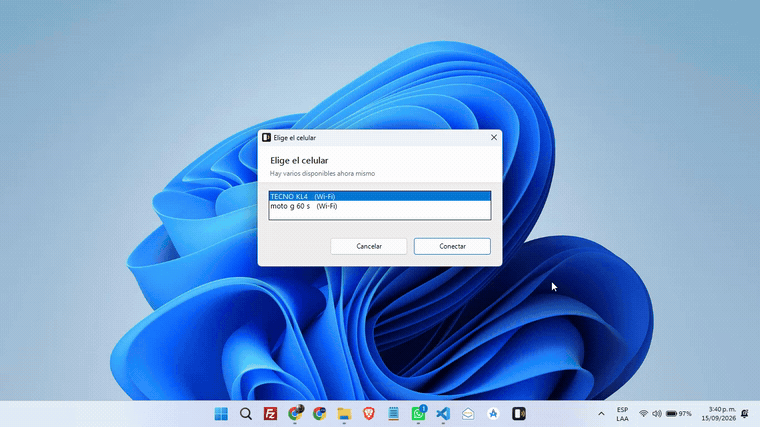

<div align="center">


# Mirador

**Tu celular en tu pantalla.**

Abre la pantalla de tu teléfono Android en el computador y contrólalo con
el mouse y el teclado — por Wi-Fi o por cable.


</div>

---

> **Mirador es solo para Windows.** Está escrito en PowerShell y usa las
> ventanas de diálogo de Windows. No funciona en macOS ni en Linux.

## Qué es

[scrcpy](https://github.com/Genymobile/scrcpy) es excelente y es el motor que
hace el trabajo de verdad. Pero para usarlo todos los días hay que pelear con
la terminal: acordarse de la IP del teléfono, escribir `adb connect`, saber
qué hacer cuando el router cambió esa IP, y recordar cuál de dos identificadores
crípticos es el teléfono que quieres ver.

**Mirador es el asistente que resuelve todo eso.** Haces doble clic en un ícono
y tu celular aparece. Nada más.

<div align="center">



<sub>Sin cables: elegir el celular y verlo en pantalla. Después, el segundo — cada uno en su ventana, con el nombre de su equipo en el título.</sub>

</div>

## Qué hace por ti

- **Encuentra el teléfono solo**, aunque le haya cambiado la dirección IP.
- **Te deja elegir** cuando hay varios teléfonos, mostrando marca y modelo —
  no identificadores crípticos.
- **Abre varios a la vez**, cada uno en su ventana.
- **Nunca te deja bloqueado.** Si algo falla te dice qué pasó y te ofrece
  reintentar, en vez de cerrarse sin explicación.
- **Te guía para preparar el teléfono**, con la ruta exacta del menú de **tu**
  marca — porque no se llama igual en un Samsung que en un Xiaomi.
- **Revisa tu equipo y te dice qué falta**, en español, en vez de mandarte a
  leer un archivo de registro.
- **Instala scrcpy solo** la primera vez, sin pedir permisos de administrador.
  (De ahí sale también `adb`, que Windows no trae.)
- **Todo en ventanas de Windows.** No hay consola que leer.

## Cómo encuentra tu teléfono

Este es el corazón de Mirador. Cuando no hay ningún teléfono listo, prueba
cuatro caminos, del más rápido al más lento, y solo te pregunta si fallan todos:

|     | Camino                              | Qué resuelve                                                   |
| :-- | :---------------------------------- | :------------------------------------------------------------- |
| 1   | **Memoria**                         | El teléfono de siempre, en menos de un segundo                 |
| 2   | **Descubrimiento en la red (mDNS)** | **Le cambió la IP.** Lo encuentra por su nombre, que no cambia |
| 3   | **Rastreo de la red**               | Teléfonos en modo `adb tcpip`, buscando el puerto 5555         |
| 4   | **Te pregunta**                     | Con botones para reintentar, emparejar o rastrear otra vez     |

El paso 2 es el que hace la diferencia. Con la **Depuración inalámbrica** de
Android, tu teléfono se anuncia en la red con un nombre fijo —algo como
`adb-XXXXXXXX._adb-tls-connect._tcp`— y Mirador guarda **ese nombre**, no la IP.
Por eso sigue funcionando cuando el router reparte direcciones nuevas.

## Requisitos

- **Windows 10 u 11** con PowerShell 5.1 (viene incluido).
- Un teléfono **Android 5.0 o superior**. Para usarlo sin cable, Android 11+.
- Que el teléfono y el computador estén **en la misma red Wi-Fi**.

No hace falta instalar scrcpy ni adb: Mirador se encarga la primera vez.

## Instalación

**1. Descarga `MiradorSetup.exe`** desde [Releases](../../releases).

**2. Ábrelo y dale a Siguiente.** Se instala en tu carpeta de usuario, crea el
acceso directo en el Escritorio y en el menú Inicio, y queda en «Agregar o
quitar programas» por si algún día lo quieres quitar. **No pide permisos de
administrador.**

> **Windows va a mostrarte un aviso** que dice que no reconoce la aplicación.
> Es lo normal con el software de desarrolladores independientes: para que no
> salga hay que pagar un certificado de firma de unos 200 dólares al año, y
> Mirador es gratuito. Pulsa **«Más información» → «Ejecutar de todas formas»**.
> Si prefieres no fiarte de mi palabra —y haces bien—, el código está completo
> en este repositorio y puedes leerlo antes: es un solo archivo de texto.

<details>
<summary>¿Prefieres instalarlo sin el <code>.exe</code>?</summary>

Descarga el código y ejecuta el instalador de PowerShell. Hace exactamente lo
mismo y usa la misma carpeta:

```powershell
git clone https://github.com/jariassh/mirador.git
cd mirador
powershell -ExecutionPolicy Bypass -File .\instalar.ps1
```

</details>

**3. Prepara el teléfono** (una sola vez)

```
Ajustes › Acerca del teléfono › toca 7 veces «Número de compilación»
Ajustes › Opciones de desarrollador › activa «Depuración USB»
```

Si lo vas a usar sin cable, activa también **«Depuración inalámbrica»**.

**4. Abre «Mirador»** desde el Escritorio.

## Usarlo sin cable

Si tu teléfono no tiene puerto USB útil —o simplemente no quieres el cable—,
Mirador se conecta por Wi-Fi de principio a fin:

1. En el teléfono: _Ajustes › Opciones de desarrollador › **Depuración
   inalámbrica** › Vincular dispositivo con código de vinculación_.
2. En Mirador, cuando no encuentre nada, pulsa **«Emparejar Wi-Fi»**.
3. Mirador **detecta la dirección solo** (el teléfono se anuncia en la red
   mientras muestra el código). Tú solo escribes los 6 dígitos.

Se hace una vez. De ahí en adelante te reconecta solo.

## Varios teléfonos

Si hay más de uno conectado, Mirador te muestra una lista con **marca y
modelo**, y marca con un punto los que ya tienes abiertos. Puedes tener
varios abiertos al mismo tiempo —como en la captura de arriba—: cada ventana
lleva el nombre de su teléfono, y al volver a abrir Mirador te trae al frente
el que elijas en vez de abrir una ventana repetida.

## Si algo falla

Mirador deja un registro de lo que intentó:

```
%LOCALAPPDATA%\Mirador\mirador.log
```

Ábrelo con el Bloc de notas. Ahí se ve exactamente en qué paso se quedó.

**Los dos tropiezos más comunes:**

- **«El celular está conectado pero falta autorizarlo»** — mira la pantalla
  del teléfono: hay un aviso pidiendo permiso. Toca «Permitir».
- **El teléfono se reinició y ya no conecta** — si lo usabas en modo
  `adb tcpip`, ese modo se pierde al reiniciar. Vuelve a conectarlo por cable
  una vez, o usa **Depuración inalámbrica**, que sí sobrevive al reinicio.

## Desinstalar

Si lo instalaste con `MiradorSetup.exe`, quítalo desde **Configuración ›
Aplicaciones › Aplicaciones instaladas**, como cualquier otro programa.

Si lo instalaste con el script:

```powershell
powershell -ExecutionPolicy Bypass -File .\instalar.ps1 -Desinstalar
```

Las dos vías quitan el acceso directo y la carpeta. **Ninguna toca scrcpy ni
adb** — si también los quieres quitar: `winget uninstall Genymobile.scrcpy`.

## Estructura

```
mirador/
├── mirador.ps1        el asistente
├── instalar.ps1       instalador y desinstalador por línea de comandos
├── instalador/        el guion de Inno Setup que produce MiradorSetup.exe
└── recursos/          el ícono (.ico y .svg editables) y las capturas
```

## Créditos

El trabajo pesado lo hace **[scrcpy](https://github.com/Genymobile/scrcpy)**,
de [Genymobile](https://www.genymobile.com/), publicado bajo licencia
Apache-2.0. Mirador no lo modifica ni lo redistribuye: lo instala desde su
fuente oficial y lo invoca. Todo el mérito del espejo en sí es suyo.

## Licencia

MIT — ver [LICENSE](LICENSE).

## Autor

**Jonathan Arias** · [@jariassh](https://github.com/jariassh) · [jariash.com](https://jariash.com)

¿Un error o una idea? Abre un [issue](../../issues).

---

<div align="center">

Mirador lo hice para resolverme un problema mío, y quedó lo bastante bien como
para publicarlo. Si necesitas algo así para tu negocio —una herramienta interna,
una automatización, un agente— eso es justo a lo que me dedico.

**[Ver a qué me dedico →](https://servicios.jariash.com)**

</div>
